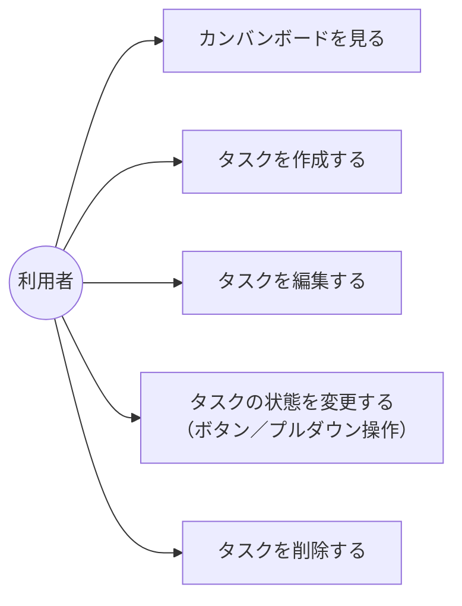

# 要件定義書：Trello風タスク管理アプリ

## 1. 概要

付箋（カード）形式でタスクを管理する、シンプルなカンバン方式のタスク管理アプリを作成する。

## 2. 背景・目的

スクールの課題として、システム開発の一連の流れ（要件定義 → 設計 → 実装 → テスト → リリース）を学ぶこと、およびAIと協働してアプリを開発する進め方を学習することを目的とする。実務で使われる小規模開発を想定し、まずは必要最小限の機能に絞って構築する。

## 3. 対象ユーザー

- 自分1人で日々のタスクを管理したい人
- 複数人での共有・同時編集は想定しない

## 4. 機能要件

| No. | 機能 | 内容 |
|---|---|---|
| 1 | タスクの作成 | タイトルを入力して新規タスクを追加できる（タイトルは1文字以上100文字以内、空文字は登録不可） |
| 2 | タスクの編集 | 既存タスクのタイトルを変更できる |
| 3 | タスクの削除 | 不要になったタスクを削除できる（削除前に確認ダイアログを表示する） |
| 4 | タスクの状態管理 | タスクは「未着手」「作業中」「完了」のいずれかの状態を持つ |
| 5 | カンバン表示 | 「未着手」「作業中」「完了」の3列でタスクを一覧表示する |
| 6 | 状態の変更 | タスクの状態を変更すると、表示される列が切り替わる（カード上のボタンまたはプルダウンで変更する。ドラッグ&ドロップによる列移動は対象外） |

### 4.1 補足

- 同一列内のタスクは作成日時の昇順で表示する（並べ替え機能は対象外）。
- タスクの識別は内部的なID（作成時に自動採番）で行い、タイトルの重複は許容する。

## 5. 非機能要件

- Webブラウザ上で動作すること（最新版のGoogle Chromeを動作対象とする）
- タスクデータはブラウザのlocalStorage（ブラウザ内蔵のデータ保存領域）に保存し、外部サーバーへの送信は行わない。ブラウザを閉じても保存内容は保持される
- 特別な性能要件（大量データ、同時アクセス等）は求めない。想定データ量は数十件程度のタスクとする
- スマートフォン対応は必須としない（学習目的のため今回は対象外）

## 6. 対象外（今回のスコープに含めない機能）

以下は今後の拡張候補とし、今回の要件には含めない。

- ログイン・ユーザー管理機能
- 複数ユーザーでの共有・同時編集
- タスクの期限日設定
- ドラッグ&ドロップによる列移動操作
- 担当者・タグ・優先度などの付加情報
- 通知機能
- セキュリティ要件（認証・認可、通信の暗号化など）
- アクセシビリティ対応（スクリーンリーダー対応など）

## 7. 制約条件

- 学習目的のプロジェクトであり、実装はAI（Claude Code）と協働して進める
- 開発の全工程（要件定義・設計・実装・テスト・リリース）を経験することを重視し、まずは小さく作ることを優先する

## 8. 画面設計

### 8.1 ユースケース図（概要）

利用者（アクター）ができる操作は以下の5つとする。



### 8.2 画面レイアウト（ワイヤーフレーム）

画面はカンバンボード画面の1画面のみとする。タスクの作成もこの画面内（モーダルまたは上部フォーム）で完結させる。

```
+--------------------------------------------------------------+
| 📋 タスク管理ボード                        [＋ 新規タスク]     |
+-----------------+------------------+---------------------------+
|  未着手 (2)     |   作業中 (1)     |   完了 (1)                |
+-----------------+------------------+---------------------------+
| [タスクA      ] | [タスクC      ]  | [タスクD      ]           |
| 状態:未着手▾ 🗑 | 状態:作業中▾ 🗑  | 状態:完了▾ 🗑              |
|                 |                  |                           |
| [タスクB      ] |                  |                           |
| 状態:未着手▾ 🗑 |                  |                           |
|                 |                  |                           |
| ＋ タスクを追加 | ＋ タスクを追加  | ＋ タスクを追加           |
+-----------------+------------------+---------------------------+
```

- 各カードの「状態:▾」は、4章No.6の「ボタンまたはプルダウン操作」に対応する状態変更コントロール。
- 🗑（削除）押下時は4章No.3のとおり確認ダイアログを表示する。

## 9. 成果物

- 本要件定義書
- 上記機能要件を満たすタスク管理アプリ本体（今後の工程で作成）
