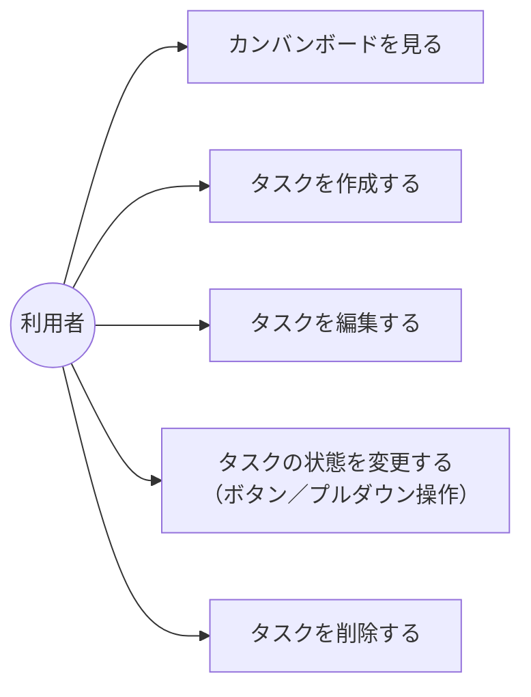

# 画面設計：Trello風タスク管理アプリ

[requirements.md](requirements.md) の要件を元にした画面設計ドキュメント。

## 1. ユースケース図（概要）

利用者（アクター）ができる操作は以下の5つとする。



## 2. 画面レイアウト（ワイヤーフレーム）

画面はカンバンボード画面の1画面のみとする。タスクの作成もこの画面内（モーダルまたは上部フォーム）で完結させる。

```
+--------------------------------------------------------------+
| 📋 タスク管理ボード                        [＋ 新規タスク]     |
+-----------------+------------------+---------------------------+
|  未着手 (2)     |   作業中 (1)     |   完了 (1)                |
+-----------------+------------------+---------------------------+
| [タスクA      ] | [タスクC      ]  | [タスクD      ]           |
| 状態:未着手▾ 🗑 | 状態:作業中▾ 🗑  | 状態:完了▾ 🗑              |
|                 |                  |                           |
| [タスクB      ] |                  |                           |
| 状態:未着手▾ 🗑 |                  |                           |
|                 |                  |                           |
| ＋ タスクを追加 | ＋ タスクを追加  | ＋ タスクを追加           |
+-----------------+------------------+---------------------------+
```

- 各カードの「状態:▾」は、[requirements.md](requirements.md) 4章No.6の「ボタンまたはプルダウン操作」に対応する状態変更コントロール。
- 🗑（削除）押下時は4章No.3のとおり確認ダイアログを表示する。
