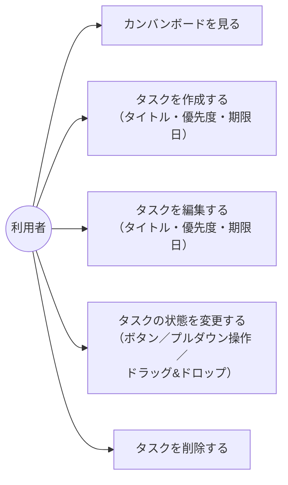

# 画面設計：Trello風タスク管理アプリ

[requirements.md](requirements.md) の要件を元にした画面設計ドキュメント。

## 1. ユースケース図（概要）

利用者（アクター）ができる操作は以下の5つとする。



## 2. 画面レイアウト（ワイヤーフレーム）

画面はカンバンボード画面の1画面のみとする。タスクの作成もこの画面内（モーダルまたは上部フォーム）で完結させる。

```
+--------------------------------------------------------------+
| 📋 タスク管理ボード                        [＋ 新規タスク]     |
+-----------------+------------------+---------------------------+
|  未着手 (2)     |   作業中 (1)     |   完了 (1)                |
+-----------------+------------------+---------------------------+
| ┃🔴 タスクA        | ┃🟡 タスクC        | ┃🟢 タスクD        |
| 期限: 08/20         | 期限: 未設定        | 期限: 08/10         |
| 状態:未着手▾ ✎編集 | 状態:作業中▾ ✎編集 | 状態:完了▾ ✎編集   |
|                     |                     |                     |
| ┃🟡 タスクB        |                     |                     |
| 期限: 未設定        |                     |                     |
| 状態:未着手▾ ✎編集 |                     |                     |
+-----------------+------------------+---------------------------+
```

- カード左端の縦線（┃）と丸アイコンは優先度を表す色分け（[requirements.md](requirements.md) 4章No.7）：🔴 高 / 🟡 中 / 🟢 低。
- 「期限:」行は期限日（[requirements.md](requirements.md) 4章No.8）。未設定の場合は「未設定」と表示。期限を過ぎていて未完了のカードは、この行を強調色（赤字）で表示する。
- カード全体はドラッグ可能（掴んでいることが分かるよう `grab` カーソルにする）。別の列にドロップすると状態が切り替わる（4章No.9）。同一列内でドロップすると、その列内での表示順を並べ替えられる（4章No.10）。
- 各カードの「状態:▾」は、4章No.6の「ボタンまたはプルダウン操作」に対応する状態変更コントロール。ドラッグ&ドロップと機能的には同じ結果（状態変更）になる、もう一つの操作手段。
- 新規タスクの作成はヘッダーの「＋ 新規タスク」ボタンから行う（作成モーダル内で状態も選択できるため、列ごとの追加ボタンは置かない）。
- 削除はカード上には置かず、「✎編集」から開く編集モーダル内の「削除」ボタン→確認UIから行う（4章No.3、3章参照）。

## 3. タスク作成・編集モーダル（イメージ）

```
+--------------------------------+
| タスクを編集                    |
|                                  |
| タイトル                        |
| [___________________________]  |
|                                  |
| 優先度        期限日            |
| [中 ▾]        [____/__/__]      |
|                                  |
|  [削除]      [保存]  [キャンセル]|
+--------------------------------+
```

- 新規作成時のみ「状態」欄（未着手／作業中／完了）も表示する。編集時は状態欄を表示しない（状態変更はカード上のプルダウンまたはドラッグ&ドロップで行うため）。
- 優先度は「高／中／低」から選択（初期値：中）。期限日は任意入力。
- 「削除」ボタンは編集モーダルのみに表示する（新規作成時は表示しない）。押下するとモーダル内の表示が確認用のUIに切り替わる（4章No.3）。

```
+--------------------------------+
| タスクを編集                    |
|  …（タイトル・優先度・期限日）  |
|                                  |
| 本当に削除しますか？            |
|                                  |
|          [キャンセル] [削除する]|
+--------------------------------+
```
